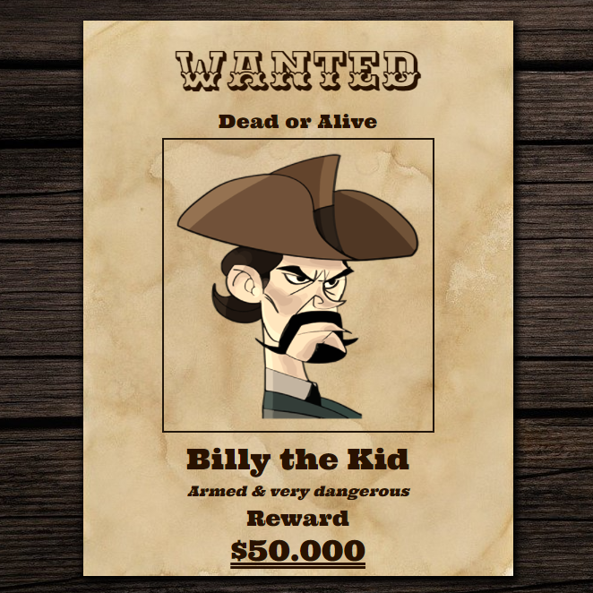

# 101 Computing - Wanted Poster (CSS Task)

This is a solution to the [Wanted Poster (CSS Task) by 101 Computing](https://www.101computing.net/wanted-poster-css-task/).
 
101 Computing challenges help you:
- Get ready for the new computing curriculum.
- Boost your programming skills or spice up your teaching of computer science.

## Screenshot
 - Based on original image (662 x 662 px). 

## The challenge
Users should be able to:
- View the optimal layout depending on their device's screen size.

## Built with
- HTML5
- CSS3

## Links
- Check out the live [example](https://dimmageiras.github.io/101-computing-wanted-poster-css-task).

## Author
- [@dimmageiras](https://github.com/dimmageiras)
